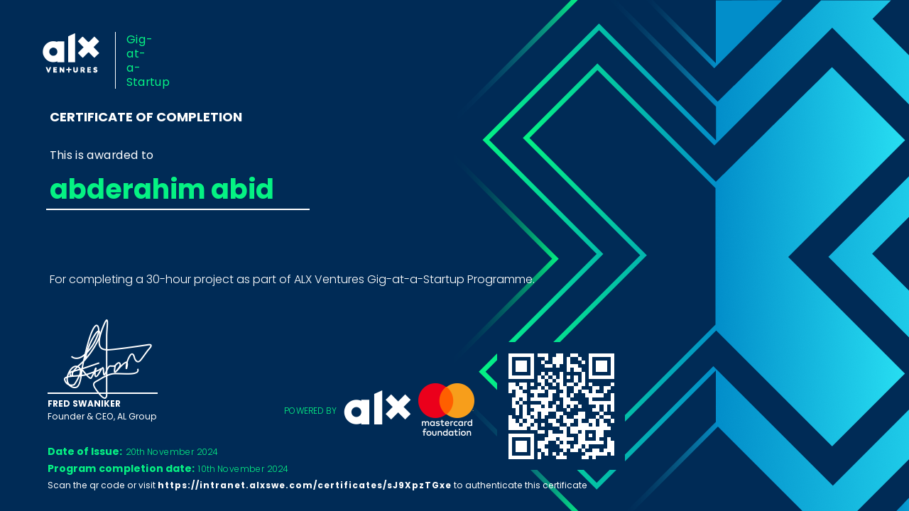

# Gig at a Startup Certificate

Hi there! 👋  
Welcome to the repository showcasing my **Gig at a Startup Certificate** and the startup project experience with **2Pi E-learning** as part of the **ALX Program**.

---

## 🌟 About the Certificate  
The **Gig at a Startup Certificate** signifies my successful completion of an intensive, real-world startup project. This program, facilitated by **ALX**, enabled me to gain hands-on experience by working on innovative e-learning solutions with **2Pi E-learning**.  

---

## 🏢 About 2Pi E-learning  
**2Pi E-learning** is a cutting-edge startup focused on revolutionizing education through modern, scalable e-learning platforms. During the project, I collaborated on building impactful solutions for educators and learners.

---

## 📌 Key Highlights of the Project  
Here are some key aspects of the project I worked on:
1. **Project Scope**:
   - Developed solutions to enhance e-learning accessibility and engagement.
   - Contributed to building features for adaptive learning and interactive content delivery.

2. **Impact**:
   - Delivered a working prototype with scalable features.
   - Improved understanding of working in a startup environment and addressing user-centric needs.

---

## 🏆 Certificate Preview  
Here’s a preview of the certificate:  

## 💡 Lessons Learned  
- **Startup Culture**: Learned how startups operate and adapt to rapidly changing environments.  
- **Teamwork**: Gained experience collaborating in a diverse, distributed team.  
- **Technical Skills**: Enhanced my proficiency in Python, Django, and agile workflows.  
- **Problem-Solving**: Tackled real-world challenges and delivered meaningful solutions.

---
